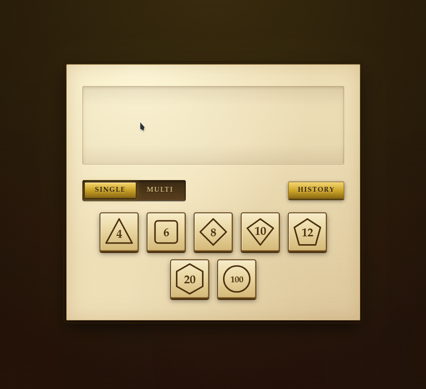

# [Dice roller with good UX](https://girvel.github.io/diceroller)

All dice rollers that I found are bullshit, so here's one with UX

## Note from the developer

This is a work in UX design, not in programming; don't look at the code, it may be very sketchy.
